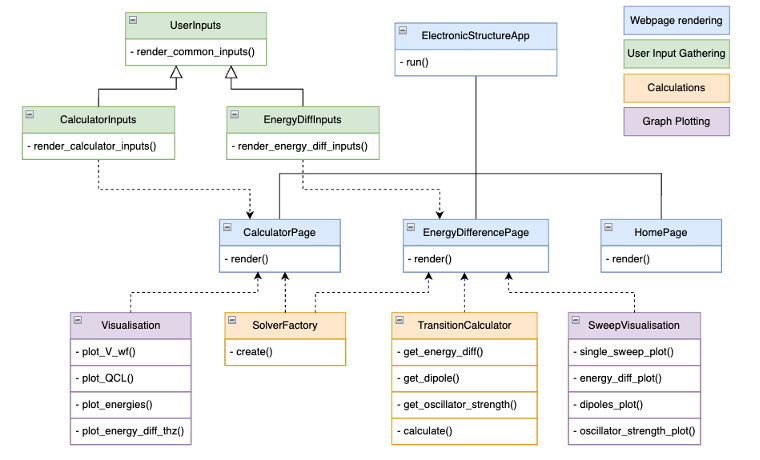
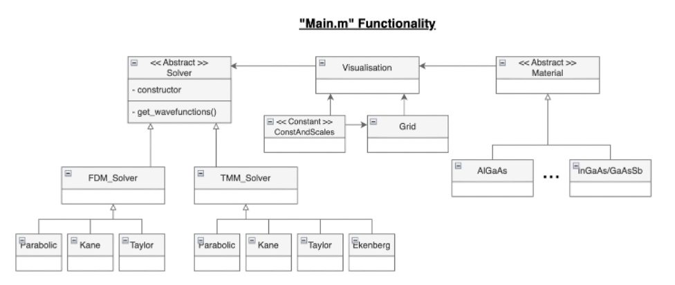

## Quick Reference:

Website: [https://dtmm-schrodinger.streamlit.app/](https://dtmm-schrodinger.streamlit.app/) (last sync’d with this repository 12/05/2026)

Activate virtual environment: 

```bash
source venv/bin/activate
```

Python from command line: in `dTMM_Schrodinger/python_implementation` run 

```bash
python Main.py
```

Streamlit from command line: in `dTMM_Schrodinger`  run

```bash
streamlit run App.py
```

## Using the Python Implementation

### SETUP: Required for options 1, 2

This project makes use of virtual environments to isolate the project’s dependencies from potential conflicts from other python packages on the user’s local machine. 

**Setup your virtual environment** 

In this project’s repository, run the relevant commands. NOTE: The .gitignore should ignore your venv, it should be setup for each user seperately.

```bash
# Create a virtual environment 
python -m venv venv

# Activate the virtual environment

#  on Windows
venv\Scripts\activate

# on macOS and Linux
source venv/bin/activate
```

**Install relevant packages**

All of the necessary python packages for this repo are in the requirements.txt file. These can be installed by running

```bash
pip install -r requirements.txt
```

Now your terminal should be setup within your virtual environment. From now you only need the commands

```bash
# To activate
#  on Windows
myenv\Scripts\activate

# on macOS and Linux
source myenv/bin/activate

# To deactivate (all OS)
deactivate
```

### 1. Run Python script from command line

Follow SETUP instructions above.

This option is the same as running any python script. The project contains a “Main.py”. Often it’s helpful to develop and test functionality here before adding it to the UI. 

To do so, enter the `dTMM_Schrodinger/python_implementation` directory and run

```bash
python Main.py
```

### 2. Run Streamlit from command line

Follow SETUP instructions above.

This option is sometimes preferred to using the website as it uses local compute resources which are typically much faster than using the cloud. 

To do so, navigate to the top level directory `dTMM_Schrodinger` and run

```bash
streamlit run App.py
```

### 3. Run Streamlit from website

Simply click this link: [https://dtmm-schrodinger.streamlit.app/](https://dtmm-schrodinger.streamlit.app/) 

The website might be in hibernation if the App has been inactive for more than a few hours.

Additionally: Read this section below on creating a Steamlit page for this directory.

## Linking this repository to Streamlit Page

Please note, the website link is synced to a forked version of this repository (this was because you must have admin rights to a repository to create a Streamlit Page for it). Therefore, any updates made to [App.py](http://App.py) in this repository will not make changes to the App found on the URL. However, it will make changes to the app if you run Streamlit from command line.

To make a new website which is connected to this repo, follow the instructions on the Streamlit page. [https://streamlit.io/cloud](https://streamlit.io/cloud)

Generally, you need to sign into your GitHub account, specify the repository you wish to deploy a website for, and give the website a URL. 

## Software Architecture Overview

### Source code class diagram



### User interface class diagram

Generally the user interface aims to separate responsibilities into webpage rendering, input gathering, calculations, and graph plotting. This allows for reuse of functions and simplified modification. 



### To create a new page:

In the `/dTMM_Schrodinger/python_implementation/ui` directory create a new file e.g. `myNewPage.py` with a new class `myPageClass`. 

Then in [App.py](http://App.py), import `myPageClass` at the top of the file and add it to the list of pages on lines 16-20.
